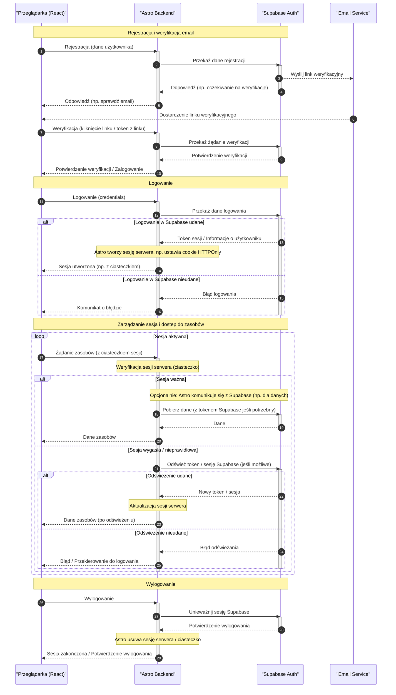

<authentication_analysis>

- Przepływy autentykacji:
  1. Rejestracja: Przeglądarka (React) wysyła dane do backendu Astro. Astro przekazuje je do Supabase Auth, który wysyła link weryfikacyjny na email. Po kliknięciu linku, Przeglądarka wysyła żądanie weryfikacji do Astro, a Astro do Supabase.
  2. Logowanie: Przeglądarka wysyła dane logowania do Astro. Astro komunikuje się z Supabase Auth, który zwraca token sesji. Astro przekazuje token do Przeglądarki (często w formie bezpiecznego ciasteczka HTTPOnly).
  3. Zarządzanie sesją i odświeżanie tokenu: Przeglądarka wysyła żądania do Astro. Astro weryfikuje sesję (np. przez ciasteczko) i w razie potrzeby komunikuje się z Supabase w celu odświeżenia tokenu, zanim przekaże żądanie lub zwróci odpowiedź.
  4. Wylogowanie: Przeglądarka wysyła żądanie wylogowania do Astro. Astro komunikuje się z Supabase, aby unieważnić sesję, a następnie usuwa ciasteczko sesyjne z Przeglądarki.
- Aktorzy:
  • Przeglądarka (aplikacja React działająca w Astro)
  • Astro Backend (działający jako proxy i zarządzający sesją po stronie serwera)
  • Supabase Auth (serwis autentykacji)
  • Email Service (do weryfikacji rejestracji)
  </authentication_analysis>

<mermaid_diagram>

</mermaid_diagram>
