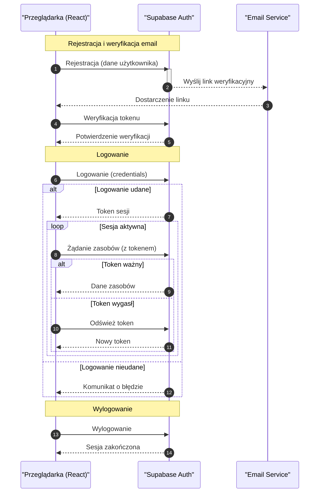

<authentication_analysis>

- Przepływy autentykacji:
  1. Rejestracja: Przeglądarka wysyła dane do Supabase Auth, który wysyła link weryfikacyjny na email. Po kliknięciu linku konto jest aktywowane.
  2. Logowanie: Przeglądarka wysyła dane logowania, a Supabase Auth zwraca token sesji.
  3. Weryfikacja i odświeżanie tokenu: Token jest używany do dostępu do zasobów, a w przypadku wygaśnięcia następuje jego odświeżenie.
  4. Wylogowanie: Przeglądarka wysyła żądanie wylogowania, co kończy sesję.
- Aktorzy:
  • Przeglądarka (aplikacja React z TypeScript, Tailwind, Shadcn/ui)
  • Supabase Auth (serwis autentykacji i zarządzania sesją)
  • Email Service (opcjonalnie, do weryfikacji rejestracji)
  </authentication_analysis>

<mermaid_diagram>

</mermaid_diagram>
